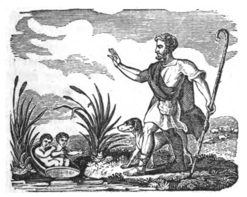

## CHAPTER VII.

### ROME.

There are many accounts of the [first building of Rome](https://en.wikipedia.org/wiki/Founding_of_Rome); the most generally accepted I will give you; but you will find, though very entertaining, it is by no means certain.

I told you that, after the sacking of [Troy](https://en.wikipedia.org/wiki/Troy), [Æneas](https://en.wikipedia.org/wiki/Aeneas) fled to [Carthage](https://en.wikipedia.org/wiki/Carthage), and, after staying there some time, deserted [Queen Dido](https://en.wikipedia.org/wiki/Dido), and sailed away. After many adventures, he landed with his little party on the coast of Italy, in Europe. There he married, and built a city, and reigned in it, and his sons after him.

[Numitor](https://en.wikipedia.org/wiki/Numitor), a descendant of his, the fifteenth king from Æneas, many years after his death, was deposed (that is, removed from his throne) by his brother [Amulius](https://en.wikipedia.org/wiki/Amulius); his son was killed; and his daughter [Rhea Silvia](https://en.wikipedia.org/wiki/Rhea_Silvia) was obliged to become a [vestal virgin](https://en.wikipedia.org/wiki/Vestal_Virgin), that she might not marry and have children.

Rhea, however, happened to have twin sons; and as soon as Amulius heard of their birth, he ordered Rhea to be buried alive, and her children to be thrown into the [River Tiber](https://en.wikipedia.org/wiki/Tiber).

The poor babes were put into a basket accordingly, and placed by the water, that, when the river rose, it might carry them away and drown them. However, the infants were so light, that the basket floated and the children were saved. — Some say a wolf suckled them — an almost incredible thing; for wolves, you know, are remarkably fierce and bloodthirsty. Other writers relate, that the woman who preserved and nursed them was called Lupa; and, as Lupa is the Latin word for she wolf, this caused the mistake.

Be that as it may, the two boys throve, and grew strong and bold. They were called [Romulus and Remus](https://en.wikipedia.org/wiki/Romulus_and_Remus): became shepherds, and were fond of hunting the wild beasts. At last, they were told of their high birth, and that, in right of their mother, they ought to be kings of the country. They therefore collected their friends, fought against their wicked uncle, and killed him: so that then their old grandfather Numitor came again to his throne. After forty-two years' exile, to be sure, he would be happy to return to his crown; and he would be proud to owe it to the bravery of his grandsons.

Romulus and Remus persuaded him to build a new city. Cities in those days were not what they are now; I suppose, a few, low-built houses, with mud walls, erected near each other, were thought a very fine city; for Europe was then as barbarous as some part of America is now.

These young men had nearly quarrelled in deciding where this city should stand: but Numitor advised them to watch the flight of birds — a custom common in that age, when any debated point was to be settled. They took their stations on different hills. Remus saw six vultures; Romulus twice as many. Remus said he was victorious, because the birds first appeared to him; Romulus insisted that, as he had seen the greater number, he was the conquerer.

From words they came to blows; and, I am sorry to tell you, Remus was killed by his brother.[^1] Romulus now became sole master; and at eighteen years of age, laid the foundation of a city which was to give laws to all the world.
[^1]: [Livy](https://en.wikipedia.org/wiki/Livy)

It was named Rome after him, was built in a square form, and contained one thousand houses. Some of the laws he made were excellent. He had a senate, of one hundred men, to assist him to govern. They were called *Patricians*, from *patres*, the Latin for *fathers*; and the common people were called *Plebeians*, from *plebes*, the *commonalty*.

They had priests to perform religious ceremonies; for you will observe, as you read history, that the most rude and ignorant nations worship God, in some form or other, "believe in Him, fear Him, love Him."

The Romans had also an army, composed of horse and foot soldiers; and great numbers of men flocked to them from the little towns near Rome: thus every day the city increased in power and extent. About the time that Rome was founded, B.C. 753, [Sparta](https://en.wikipedia.org/wiki/Sparta) changed its form of government, and, instead of thirty senators; had only five magistrates, called *Ephori*.